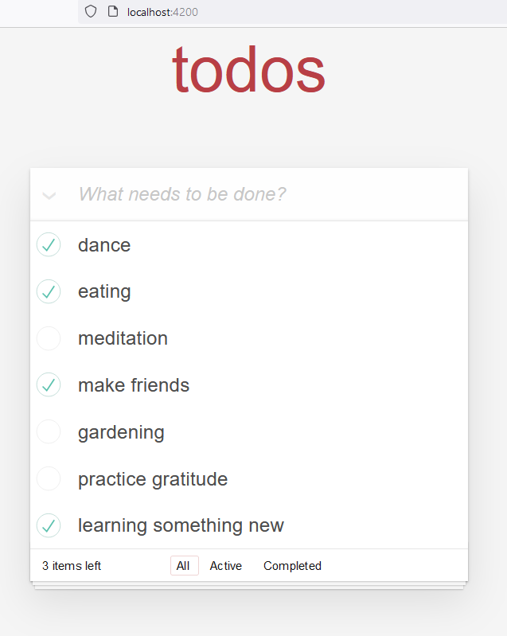

# Todo App Angular 17

To Do App é uma aplicação de gerenciamento de tarefas desenvolvida em Angular 17, que permite o usuário inserir, editar (utilizando clique duplo na linha), marcar como concluída e/ou excluir tarefas da lista.

## Como rodar a aplicação Angular

1. **Clone o repositório:**
  ```bash
    git clone https://github.com/cidaluna/todo-app-angular-17.git
  ```

2. **Navegue no diretório principal**
  ```bash
    cd todo-app-angular-17
  ```

3. **Execute o comando**
  ```bash 
    npm install
  ```

4. **Execute a aplicação Angular**
  ```bash 
    ng serve
  ```

5. **Navegue na URL que o comando anterior apresentou**

  Em seguida, a aplicação estará disponível em: http://localhost:4200


## Screenshots

Tela da aplicação ToDo List Angular:


